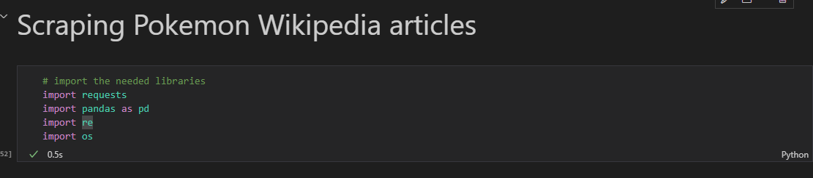
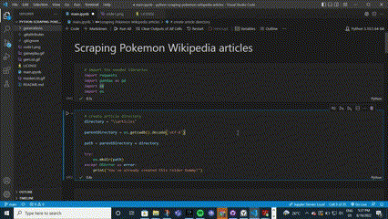
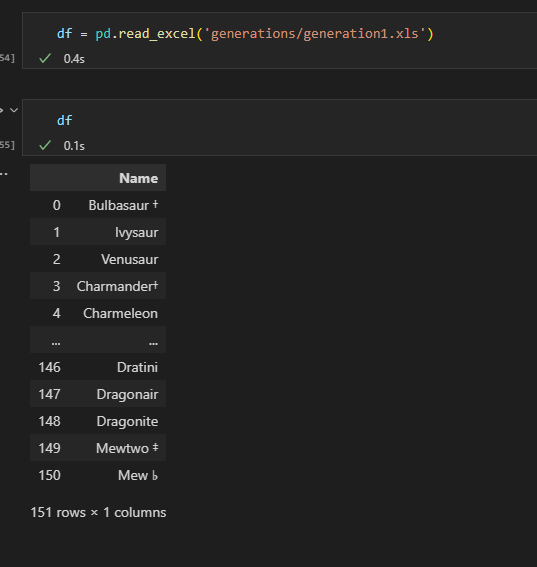
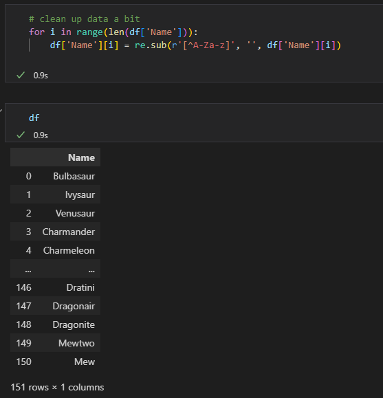
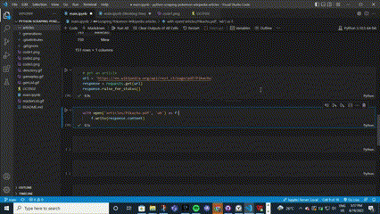

# Scraping Pokemon Articles

 <ul>
   <li>
     
Being a big fan of the Pokemon Franchise. I was curious about the details on every pokemon there is. I want to be read up on any pokemon in my free time.

   </li>
   <li>
     
So I found a list of all the Pokemon from wikipedia and copied the table into a Spreadsheet

   </li>
 </ul>
 

  

 <ul>
   <li>
     
Then I split that spreadsheet into various spreadsheets each containing each generation of pokemon

   </li>
 </ul>
 

  

<h2>Coding</h2>

 <ul>
   <li>
     
First, I imported the necessary libraries. That is 'pandas', 'requests', 'os', 're'

   </li>
 </ul>
 

  

 <ul>
   <li>
     
Second, I created a directory (using python) to store the articles

   </li>
 </ul>
 

 

<ul>
  <li>
    
Then, I loaded up "generation1.xls" to run logic tests on

  </li>
</ul>

  

 <ul>
   <li>
     
I didn't want the special characters in the file to mess up my program so I used Regex to take care of them

   </li>
 </ul>
 
 

  
 

## Algorithm and test
What I want to do is simple but how do I do it programatically.
1. Okay, I can make an article request to the Wikipedia API and check if everything went okay
2. Then write the article in binary form to file on my disk
Let's do that in code.

